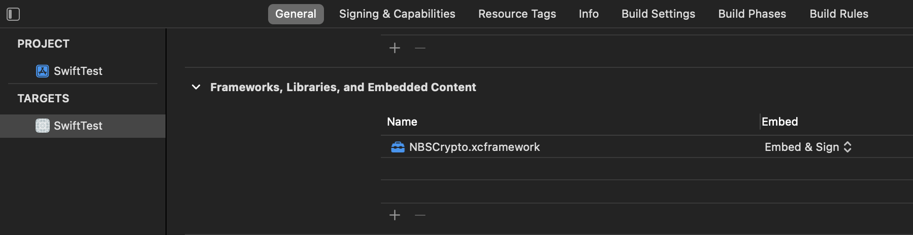
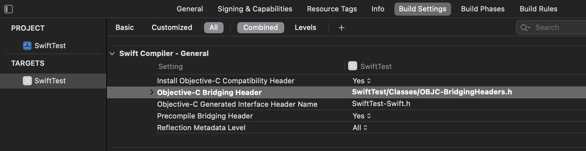

# Integrate `NBSCrypto` into Swift


## Adding the `NBSCrypto` Framework
To add the `NBSCrypto.xcframework` to your Swift project click the `+` button and choose the `NBSCrypto.xcframework` from your file system or drag n drop it.

<picture></picture>
#


## Objective-C Bridging Header

### Create an Objective-C Bridging Header
Add a `.h` file to your Swift project and name it `OBJC-BridgingHeader.h`.
Copy the following code into it.
```
//  OBJC-BridgingHeaders.h

#ifndef OBJC_BridgingHeaders_h
#define OBJC_BridgingHeaders_h

#import <NBSCrypto/NBSCrypto.h>

#endif /* OBJC_BridgingHeaders_h */
```
\
If you already have an existing bridging header file, all you need to do is add this line of code in your existing bridging header file.
```
#import <NBSCrypto/NBSCrypto.h>
```


### Link the Objective-C Bridging Header to Build Settings
To link the bridging header file your have to go to the `Build Settings` of your project and link the bridging header `.h` file in the section `Swift Compiler - General` - see picture below. _(The picture show the linking if the `.h` file as a common part of the project and is located in the directory/folder `Classes` in your project)_.

<picture></picture>
